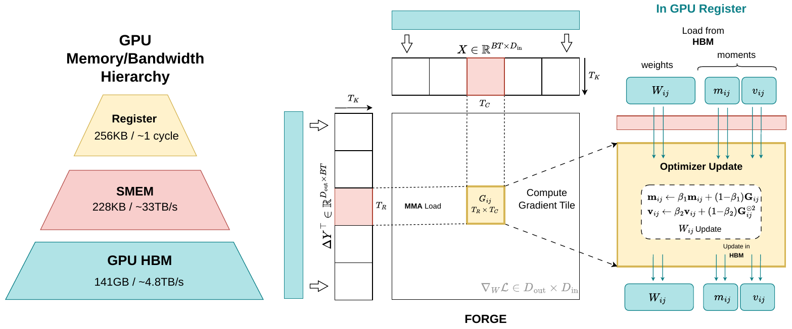
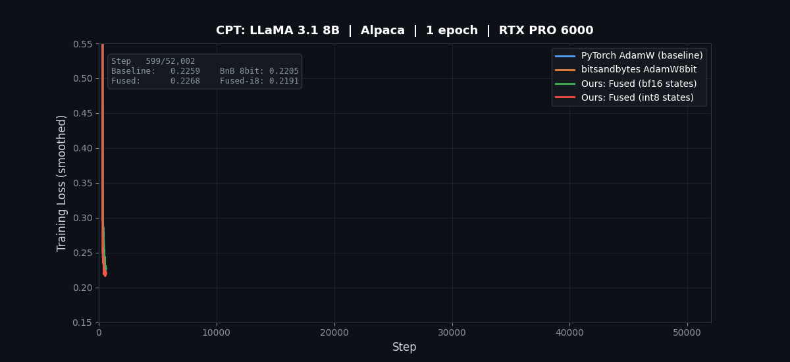
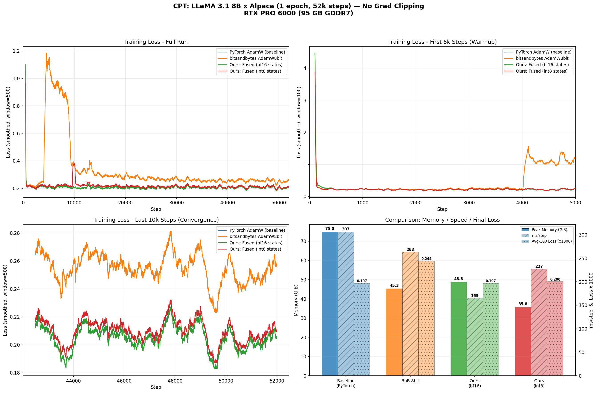

<div align="center">

# 🔥 FORGE

### Fused On-Register Gradient Elimination for Memory-Efficient LLM Training

*The weight gradient is an artifact of how autograd is staged — not something learning needs. FORGE removes it.*

[](LICENSE)
[](https://www.python.org/)
[](https://pytorch.org/)
[](https://github.com/triton-lang/triton)
[](CONTRIBUTING.md)

</div>

---

Standard training computes `grad_W = grad_output.T @ input` as a **full tensor in HBM**, then runs `optimizer.step()` to read it back. For an 8B model the live gradients alone cost 15+ GB — and at the seam between backward and the optimizer step, **every layer's gradient is live at once**, setting the memory ceiling of training.

**FORGE fuses the optimizer step into the backward pass and applies it one tile at a time, entirely in GPU registers.** Each weight-gradient tile is produced, consumed by the optimizer, and discarded before the next tile is computed. **The full `grad_W` tensor never exists in HBM.**

<div align="center">

<br><em>For each weight tile, the gradient is accumulated in registers and the AdamW update is applied immediately — then the tile is dropped.</em>
</div>

## ✨ Highlights

- **More than halves optimizer memory** — never materializes the gradient, drops the fp32 master copy and gradient buffer.
- **Faster, not just smaller** — the fused kernel runs the same GEMM with the optimizer math folded in, so it *eliminates* the separate `optimizer.step()` pass. **Up to 2.6× faster** at small batch sizes.
- **Numerically exact** — in full precision the fused step is the *identical* AdamW update; convergence matches the PyTorch baseline (see below).
- **Architecture- and optimizer-agnostic** — works on any linear layer under any element-wise rule (AdamW, SGD, RMSprop, Lion, …).
- **Composes** with INT8 optimizer states, stochastic-rounded bf16 weights, and FP8 activations.

> FORGE ships as the importable package `fused_grad_optimizer`.

## 📊 Key results (Llama-3.1-8B)

| GPU | Mode | Peak memory | Step time | vs. baseline |
|---|---|---|---|---|
| RTX PRO 6000 (GDDR7) | PyTorch fused AdamW | 75.0 GB | 306 ms | — |
| | **FORGE** | **48.8 GB** | **134 ms** | **−35% mem · 2.29× faster** |
| B200 (HBM3e) | PyTorch fused AdamW | 75.0 GB | 162 ms | — |
| | **FORGE** | **48.8 GB** | **108 ms** | **−35% mem · 1.50× faster** |

**26 GB saved** by never materializing the gradients of 225 linear layers. The speedup depends on memory bandwidth (how much `optimizer.step()` cost to begin with).

## 📉 Convergence parity (1 full epoch, Llama-3.1-8B)

4-way comparison over 52,002 steps (1 epoch), identical hyperparameters — only the optimizer differs.

<div align="center">

</div>

| Method | Avg-100 loss | Peak memory | ms/step | vs. baseline |
|---|:--:|:--:|:--:|:--:|
| PyTorch AdamW (baseline) | 0.1970 | 75.0 GiB | 307 | — |
| bitsandbytes AdamW8bit | 0.2440 | 45.3 GiB | 263 | −40% mem · 1.16× |
| **FORGE (bf16 states)** | **0.1969** | **48.8 GiB** | **165** | **−35% mem · 1.86×** |
| **FORGE (int8 states)** | **0.2004** | **35.8 GiB** | **227** | **−52% mem · 1.35×** |

- **FORGE matches baseline convergence** (0.1969 vs 0.1970) at 1.86× the speed.
- **FORGE-int8 uses 52% less memory** with negligible convergence impact — while bitsandbytes-8bit converges *worse* (0.2440) at the same bit-width, because FORGE feeds the optimizer an **untruncated fp32 gradient**.

<div align="center"></div>

## 🚀 Quick start

```bash
pip install -e ".[test]"      # core + tests
# pip install -e ".[bench]"   # + transformers/accelerate for the benchmarks
```

```python
import torch
from fused_grad_optimizer import FusedLinear, FusedOptimizerManager

model = YourModel().cuda()

# 1. Swap nn.Linear layers for FusedLinear
for name, module in model.named_modules():
    for child_name, child in list(module.named_children()):
        if isinstance(child, torch.nn.Linear):
            setattr(module, child_name,
                    FusedLinear.from_linear(child, optimizer_type="adamw"))

# 2. A manager coordinates the fused layers; a standard optimizer handles the rest
manager = FusedOptimizerManager(model)
optimizer = torch.optim.AdamW(manager.get_non_fused_params(), lr=1e-4, fused=True)

# 3. Train — fused layers update their weights DURING backward
for step, batch in enumerate(dataloader):
    manager.pre_step(lr=get_lr(step))
    loss = model(**batch).loss
    loss.backward()      # FORGE applies the optimizer here, tile-by-tile
    optimizer.step()     # only norms / embeddings (~0.1% of params)
    optimizer.zero_grad()
```

See [`examples/quickstart.py`](examples/quickstart.py) for a runnable toy example.

## 🧠 How it works

For each weight tile, FORGE accumulates `grad_output.T @ input` in registers via a loop over the batch dimension, then applies AdamW immediately — so the full `grad_W` is never written to HBM. The trade-off is **read amplification**: activations are re-read once per weight tile. Autotuned tile sizes, a zero-cost virtual transpose, native bf16 tensor cores, and grouped tile ordering for L2 reuse keep that cost small — and it buys the elimination of the entire optimizer step.

The update is applied **after** the input gradient `ΔX = ΔY·W` is read, so the chain rule is preserved. Weights with more than one gradient consumer in a step (tied embeddings, MoE experts) are left on the standard optimizer.

## 🖥️ Hardware support

Validated on NVIDIA datacenter / workstation GPUs via Triton:

| GPU | Arch | Notes |
|---|---|---|
| RTX PRO 6000 Blackwell | SM120 | CUDA 13, PyTorch 2.11, Triton 3.6 |
| B200 | SM100 | CUDA 12.8, PyTorch 2.10, Triton 3.6 |
| A100 / H100 / H200 | SM80/SM90 | Hopper TMA path (`kernel.py`) |

> Requires CUDA + Triton ≥ 3.4. The kernels are Triton/CUDA; AMD/Apple backends are not yet validated. A CUTLASS-DSL Blackwell port is in `docs/design/`.

## 🗂️ Repository layout

```
src/fused_grad_optimizer/   # the library
  kernel.py                 # core fused grad+optimizer Triton kernels (autotuned)
  autograd.py               # custom autograd.Function fusing backward + optimizer
  module.py                 # FusedLinear (nn.Module) + FusedOptimizerManager
  state.py                  # OptimizerConfig + lazy m/v state
  hopper_*/cutlass_*        # arch-specific kernels (H200 TMA, B200 EVT)
tests/                      # correctness: SGD/AdamW, bf16, int8, manager
examples/                   # runnable quickstart
assets/                     # figures
```

## 📝 Citation

```bibtex
@article{kukreja2026forge,
  title  = {FORGE: Fused On-Register Gradient Elimination for Memory-Efficient LLM Training},
  author = {Kukreja, Dikshant and Prasad, Kritarth and Anand, Avinash and Wang, Zhengkui
            and Cambria, Erik and Liu, Timothy and Ng, Aik Beng and See, Simon and Chatterjee, Bapi},
  year   = {2026}
}
```

## 📄 License

Apache License 2.0 — see [LICENSE](LICENSE).
