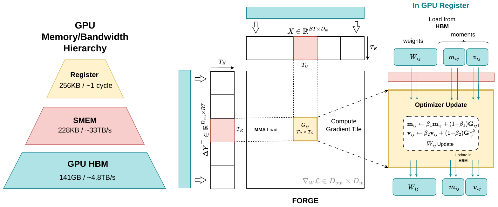
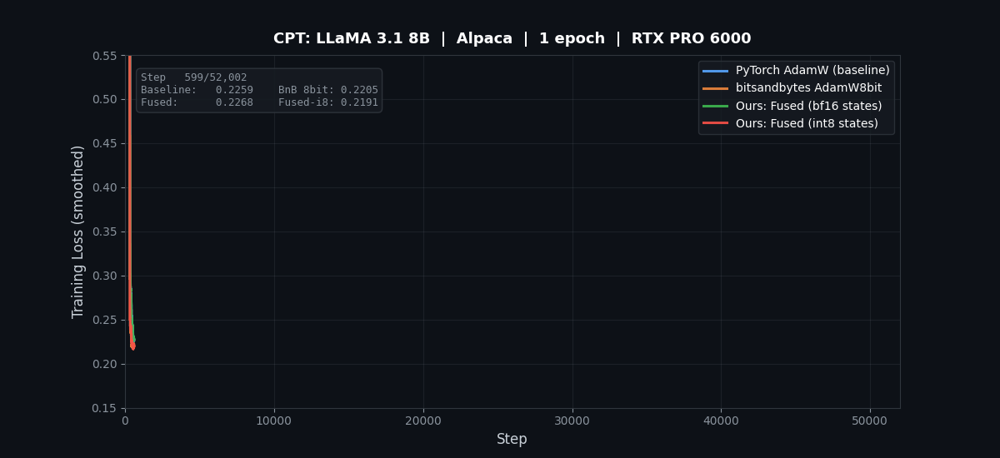

<div align="center">

# 🔥 FORGE

### Fused On-Register Gradient Elimination for Memory-Efficient LLM Training

*The weight gradient is an artifact of how autograd is staged — not something learning needs. FORGE removes it.*

[](https://arxiv.org/abs/2606.22932)
[](https://arxiv.org/pdf/2606.22932)
[](LICENSE)

**📄 Paper · [FORGE: Fused On-Register Gradient Elimination for Memory-Efficient LLM Training](https://arxiv.org/abs/2606.22932)**

[](https://www.python.org/)
[](https://pytorch.org/)
[](https://github.com/triton-lang/triton)
[](CONTRIBUTING.md)

<p align="center">
<b><a href="#-quick-start">Quick start</a> · <a href="#-key-results-llama-31-8b-single-h200">Results</a> · <a href="#-convergence-parity">Convergence</a> · <a href="#-hardware-support--results-per-gpu">Hardware</a> · <a href="#-distributed-8-gpu-rtx-pro-6000-node-pcie-no-nvlink">Distributed</a> · <a href="#-how-it-works">How it works</a> · <a href="#-citation">Cite</a></b>
</p>

</div>

---

Standard training computes `grad_W = grad_output.T @ input` as a **full tensor in HBM**, then runs `optimizer.step()` to read it back. For an 8B model the live gradients alone cost ≈15 GB — and at the seam between backward and the optimizer step, **every layer's gradient is live at once**, setting the memory ceiling of training.

**FORGE fuses the optimizer step into the backward pass and applies it one tile at a time, entirely in GPU registers.** Each weight-gradient tile is produced, consumed by the optimizer, and discarded before the next tile is computed. **The full `grad_W` tensor never exists in HBM.**

<div align="center">

<br><em>For each weight tile, the gradient is accumulated in registers and the AdamW update is applied immediately — then the tile is dropped.</em>
</div>

## ✨ Highlights

- **Deletes the gradient pool** — on Llama-3.1-8B, peak memory falls from **62.0 GB under vanilla AdamW to 48.4 GB** at matched state precision, and to **35.3 GB with int8 moments**.
- **Faster, not just smaller** — the update is folded into the weight-gradient GEMM, so the separate `optimizer.step()` pass disappears: **110.2 ms/step vs. 134.3 (fused AdamW) and 167.1 (vanilla)** — **1.52× faster** than vanilla AdamW, and **2.2–2.6× faster than bitsandbytes** at matched int8 state bytes.
- **Provably exact** — for any optimizer that updates a weight from its own gradient alone (AdamW, SGD±momentum, Lion, RMSprop, Adagrad, NAdam, RAdam, …), the fused step produces *exactly* the standard result: bit-identical to a reference that accumulates the token axis in the same order.
- **Architecture-agnostic** — one kernel, no architecture-specific code, trains GPT-2, Llama-3.1-8B, five Qwen3 sizes, vision transformers to 25B, Mamba-2 to 20B, and MLP-Mixers to 4.9B; thirteen optimizer families run end to end.
- **Converts to capability** — with fp8 moments FORGE trains **Qwen3-32B on a single H200 (134.4 GB)** where fused AdamW runs out of memory; under FSDP on an 8-GPU node it reaches the lowest per-rank memory of any method that trains the model.

> FORGE ships as the importable package `fused_grad_optimizer`.

## 📊 Key results (Llama-3.1-8B, single H200)

<div align="center">

<br><em>The weight gradient (red) collapses under FORGE; its two arms differ only in moment precision. FORGE is 1.52× faster than vanilla AdamW and 2.04× faster than bitsandbytes 8-bit, at lower memory.</em>
</div>

Single-GPU comparison on H200 (141 GB), batch 1, sequence 512, BF16 everywhere; step time is the median of 20 steps.

| Method | Peak (GB) | Step (ms) | TF/s |
|---|:--:|:--:|:--:|
| vanilla AdamW | 62.04 | 167.1 ± 18.0 | 149 ± 17 |
| fused AdamW | 60.08 | 134.3 ± 14.1 | 185 ± 21 |
| bitsandbytes 8-bit | 45.36 | 316.3 ± 20.6 | 78 ± 5 |
| **FORGE** | **48.36** | **110.2 ± 8.7** | **226 ± 15** |
| **FORGE (int8)** | **35.32** | **155.0 ± 4.4** | **159 ± 5** |

**FORGE is the only method that improves on fused AdamW on all three axes at once** — the full comparison against FlashOptim, GaLore, APOLLO, optimi, and AdaLomo is in Table 1 of the paper. Standalone, the fused update reaches **74% of the measured 4,252 GB/s HBM ceiling**, against 61% for fused AdamW, 24% for vanilla AdamW, and 8% for bitsandbytes.

**Operating regime.** What governs the saving is the token count `BT = batch × sequence`: FORGE deletes a fixed ≈15 GB (the gradient pool), so at matched bf16 states the reduction fades from 22% at `BT = 512` to nothing at `BT ≥ 4096`, where activations set the peak instead. FORGE is a small-`BT` method — the regime that dominates fine-tuning and continued pretraining. Model scale works the other way: the ratio *improves* with parameter count (Qwen3-14B fits in 87.8 GB vs. 110.3 for fused AdamW), up to the 32B-on-one-H200 point above.

## 📉 Convergence parity

<div align="center">

<br><em>1-epoch continued pretraining of Llama-3.1-8B (52k steps, identical hyperparameters): FORGE tracks PyTorch AdamW exactly, in bf16 and int8 states, while bitsandbytes 8-bit converges worse.</em>
</div>

- **From scratch:** GPT-2 124M on FineWeb-Edu tracks fused AdamW for 125k iterations and ends fractionally below it — **3.20 vs. 3.22 nats**.
- **Continued pretraining:** across Llama-3.1-8B and five Qwen3 sizes (20,000 steps, ≥ 3 seeds each), losses stay within **0.001 nats on average, 0.003 at worst**.
- **Exactness, not approximation:** the fused step is bit-identical to a reference that accumulates the token axis in the same order; against cuBLAS the only discrepancy is the summation order intrinsic to any GEMM. All thirteen implemented optimizer families train end to end.

<div align="center">
 
<br><em>Left: GPT-2 124M pretrained from random initialization on FineWeb-Edu — FORGE tracks fused AdamW throughout (3.20 vs. 3.22 nats). Right: continued pretraining on OpenMathInstruct-2 (20,000 steps, Qwen3-1.7B) — FORGE tracks fused AdamW, while bitsandbytes 8-bit drifts.</em>
</div>

<div align="center">
 
<br>
 
<br><em>The same parity holds across model scale: Qwen3 0.6B, 4B, 8B, and 14B (20,000 steps each).</em>
</div>

## 🚀 Quick start

```bash
pip install -e ".[test]"      # core + tests
# pip install -e ".[bench]"   # + transformers/accelerate for the benchmarks
```

```python
import torch
from fused_grad_optimizer import FusedLinear, FusedOptimizerManager

model = YourModel().cuda()

# 1. Swap nn.Linear layers for FusedLinear
for name, module in model.named_modules():
    for child_name, child in list(module.named_children()):
        if isinstance(child, torch.nn.Linear):
            setattr(module, child_name,
                    FusedLinear.from_linear(child, optimizer_type="adamw"))

# 2. A manager coordinates the fused layers; a standard optimizer handles the rest
manager = FusedOptimizerManager(model)
optimizer = torch.optim.AdamW(manager.get_non_fused_params(), lr=1e-4, fused=True)

# 3. Train — fused layers update their weights DURING backward
for step, batch in enumerate(dataloader):
    manager.pre_step(lr=get_lr(step))
    loss = model(**batch).loss
    loss.backward()      # FORGE applies the optimizer here, tile-by-tile
    optimizer.step()     # only norms / embeddings (~0.1% of params)
    optimizer.zero_grad()
```

See [`examples/quickstart.py`](examples/quickstart.py) for a runnable toy example.

### Architectures with custom CUDA ops (RWKV-7)

For architectures that mix `nn.Linear` projections with custom CUDA kernels, only
the Linear layers should be wrapped. RWKV-7 ("Goose") is the canonical example:
its WKV delta-rule kernel is a custom CUDA op and must keep its standard backward.

```python
from fused_grad_optimizer.model_wrappers import wrap_rwkv7

model, manager = wrap_rwkv7(model, optimizer_type="adamw", state_mode="int8")
# wrap_rwkv7 replaces every nn.Linear (key/value/receptance/output/gate/FFN/head)
# and skips the WKV op automatically — it is not nn.Linear.

non_fused_opt = torch.optim.AdamW(manager.get_non_fused_params(), lr=1e-4)
```

With `state_mode="int8"` (int8 optimizer moments), full fine-tuning of G1i 2.9B
fits on a 16 GB card (~13 GB peak vs. ~35 GB standard AdamW).

**Estimated peak VRAM — G1i 2.9B, bf16 weights, batch 1, seq 512:**

| Method | Weights | Grad tensor | Moments | Activations | Est. peak |
|---|:--:|:--:|:--:|:--:|:--:|
| standard AdamW (fp32 m,v) | 5.8 GB | 5.8 GB | 23.2 GB | ~1 GB | **~36 GB** |
| bitsandbytes 8-bit Adam | 5.8 GB | 5.8 GB | 5.8 GB | ~1 GB | **~19 GB** |
| **FORGE (int8 moments)** | 5.8 GB | **0 GB** | 5.8 GB | ~1 GB | **~13 GB** |

Formula: weights = params × 2 B (bf16); grad = weights (bf16, eliminated by FORGE);
fp32 moments = params × 8 B; int8 moments = params × 2 B.

> These are analytical estimates from the FORGE gradient-pool formula.
> Measured numbers on RTX 4090 / 5080 will replace this table once a GPU run is available.
> See [`examples/rwkv7_example.py`](examples/rwkv7_example.py).

## 🧠 How it works

For each weight tile, FORGE accumulates `grad_output.T @ input` in fp32 registers via a loop over the token dimension, then applies the optimizer immediately — so the full `grad_W` is never written to HBM. A standard bf16 step streams sixteen bytes per parameter through HBM; FORGE moves twelve, and moves them closer to peak bandwidth. The trade-off is **read amplification**: activations are re-read once per weight tile. Autotuned tile sizes, a zero-cost virtual transpose, native bf16 tensor cores, and grouped tile ordering for L2 reuse keep that cost small — and it buys the elimination of the entire optimizer step.

The update is applied **after** the input gradient `ΔX = ΔY·W` is read, so the chain rule is preserved. Weights with more than one gradient consumer in a step (tied embeddings) are left on the standard optimizer.

## 🖥️ Hardware support & results per GPU

Validated on NVIDIA datacenter / workstation GPUs via Triton, across the Qwen3 family and Llama-3.1-8B at sequence 512–4096:

| GPU | Arch | Measured on this card |
|---|---|---|
| H200 141 GB | SM90 | Headline single-GPU results; Hopper TMA path (`kernel.py`); 8×H200 NVLink |
| H100 SXM 80 GB | SM90 | Qwen3 family sweeps; the budget where baselines start to OOM |
| B200 180 GB | SM100 | Llama + Qwen3 sweeps; CUDA 12.8, Triton 3.6, FlashAttention-4 |
| RTX PRO 6000 Blackwell 96 GB | SM120 | Thirteen-optimizer sweep; 8-GPU PCIe distributed node (below) |
| A100 40/80 GB, B300 | SM80 / SM100 | Cross-platform capability study |

Peak memory is shape-deterministic and reproduces across cards to within rounding; step time is per-platform and is only ever compared within one card and one recipe. The full per-card grids — including the RTX PRO 6000 optimizer sweep, where peak falls **27–54%** and step time **28–71%** across every family — are in the [paper's supplementary appendices](https://arxiv.org/abs/2606.22932) (G: extended single-GPU grids, I: optimizer families, O: cross-platform capability).

> Requires CUDA + Triton ≥ 3.4. The default path (`kernel.py`) is pure Triton and needs no extra setup. The arch-specific research kernels (`hopper_*` / `cutlass_*`) additionally JIT-compile against [NVIDIA CUTLASS](https://github.com/NVIDIA/cutlass) — set `CUTLASS_PATH` or clone it into the repo root as `cutlass/`. AMD/Apple backends are not yet validated.

## 🗂️ Repository layout

```
src/fused_grad_optimizer/   # the library
  kernel.py                 # core fused grad+optimizer Triton kernels (autotuned)
  autograd.py               # custom autograd.Function fusing backward + optimizer
  module.py                 # FusedLinear (nn.Module) + FusedOptimizerManager
  state.py                  # OptimizerConfig + lazy m/v state
  hopper_*/cutlass_*        # arch-specific kernels (H200 TMA, B200 EVT)
tests/                      # correctness: SGD/AdamW, bf16, int8, manager
examples/                   # runnable quickstart
assets/                     # figures
```

## 📝 Citation

```bibtex
@article{kukreja2026forge,
  title   = {FORGE: Fused On-Register Gradient Elimination for Memory-Efficient LLM Training},
  author  = {Kukreja, Dikshant and Prasad, Kritarth and Anand, Avinash and Wang, Zhengkui
             and Cambria, Erik and Liu, Timothy and Ng, Aik Beng and See, Simon and Chatterjee, Bapi},
  journal = {arXiv preprint arXiv:2606.22932},
  year    = {2026}
}
```

## 📄 License

Apache License 2.0 — see [LICENSE](LICENSE).
